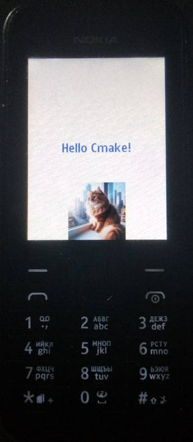
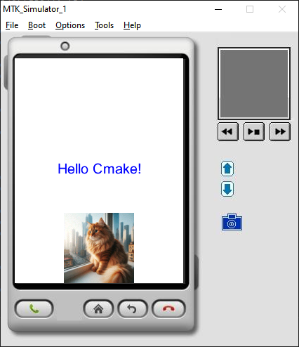
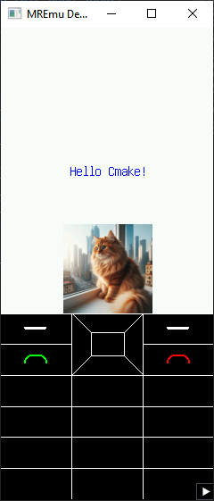

# Template for build MRE .vxp app by cmake



## What are the CMake projects in this repo about?

|Folder|Description|Type|
|-|-|-|
|cmake|Place for cmake toolchain|Toolchain|
|mreapi|A single point for the entire MRE API|Static liblary|
|main|Main code for app|Static liblary|
|resourses|A resourses pack target (there you can add own resourses)|Resourses (.res)|
|core|The application is linked here|Executable (for phone) or library (for MoDis)|
|vxp|The application is packed to vxp here|vxp|
|run/run_in_MoDis|Target for auto copy .vc.vxp to MoDis and run it (only Windows)|bat|

## Requirements to build

- cmake
- make
- gcc-arm-none-eabi
- MRE SDK (for includes, libs and MoDis) (you can find it [there](https://github.com/raspiduino/mre-sdk))
- [TinyMRESDK](https://github.com/XimikBoda/TinyMRESDK) (For resourse pack and app pack)

## How to build?
### For phone

```
mkdir build
cd build
cmake -DCMAKE_TOOLCHAIN_FILE=../cmake/toolchain-arm-none-eabi.cmake -DMRE_SDK=path/to/mre/sdk -DTinyMRESDK=path/to/tiny/mre/sdk -DCMAKE_BUILD_TYPE=Release -G "MinGW Makefiles" ..
make
```

If it can`t find right gcc, add ```-DTOOLCHAIN_PREFIX=path/to/gcc/arm/none/eabi``` to cmake

### For MoDis simulator (only on Windows)

```
mkdir vs
cd vs
cmake -DMRE_SDK=path/to/mre/sdk -DTinyMRESDK=path/to/tiny/mre/sdk -G "Visual Studio 17 2022" -A Win32 ..
Demo.sln
```

Also you can use cmake gui for config (Don`t forget to set MRE_SDK and TinyMRESDK variables)

## How to run

**Note** You can't run `.vxp` on MoDis and `.vc.vxp` on phone. 
### On phone

**Note**: If you use Nokia phone, you need to add your IMSI (```-DIMSI="91234567890"```) with 9 at begin (because of mre api bug)

Just copy `build/vxp/vxp.vxp` to sd-card

### On MoDis simulator (only on Windows)

You can use `run_in_MoDis` target (right click and `Set as Startup Project`), but if you want to debug it, manualy change *Command* (in project properties) to MoDis.exe.

Or you can manualy copy `vs/vxp/vxp.vc.vxp` to MoDis.

## How to create own project

- Copy this to new folder.
- Change app/developer name and other settings in base `CMakeList.txt`.
- Add you .cpp, .c and .h to `main/CMakeList.txt`. 
- Copy resourses to `resourses/` and add it to `resourses/CMakeList.txt`.
- If you want to add CMake liblary, add it as static lib (you can use `set(BUILD_SHARED_LIBS FALSE)`)