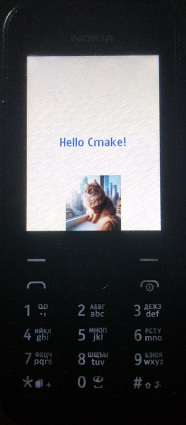
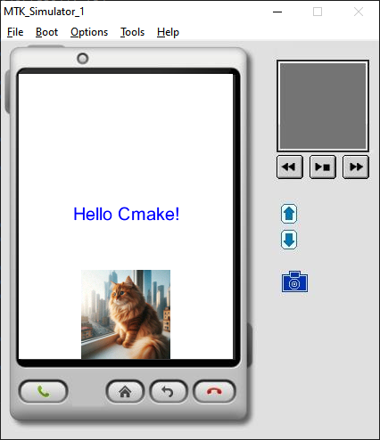
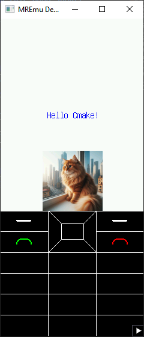

# Template for build MRE .vxp app by cmake



## What are the CMake projects in this repo about?

|Folder|Description|Type|
|-|-|-|
|cmake|Place for cmake toolchain and functions|Toolchain|
|mreapi|A single point for the entire MRE API|Static liblary|
|main|Main code, linking and packing vxp|vxp|
|common|Files for compiling/linking apps|.|
|resources|A resources pack target (there you can add own resources)|Resources (.res)|
|run/run_in_MoDis|Target for auto copy .vc.vxp to MoDis and run it (only Windows)|bat|

## Requirements to build

- cmake
- make
- gcc-arm-none-eabi
- MRE SDK (for includes, libs and MoDis) (you can find it [there](https://github.com/raspiduino/mre-sdk))
- [TinyMRESDK](https://github.com/XimikBoda/TinyMRESDK) (For resourse pack and app pack)

## How to build?
### For phone

```
mkdir build
cd build
cmake --preset arm-release -DMRE_SDK=path/to/mre/sdk -DTinyMRESDK=path/to/tiny/mre/sdk ..
make
```

If it can`t find right gcc, add ```-DTOOLCHAIN_PREFIX=path/to/gcc/arm/none/eabi``` to cmake

### For MoDis simulator (only on Windows)

```
mkdir vs
cd vs
cmake --preset win32 -DMRE_SDK=path/to/mre/sdk -DTinyMRESDK=path/to/tiny/mre/sdk ..
Demo.sln
```

Also you can use cmake gui for config (Don`t forget to set MRE_SDK and TinyMRESDK variables)

**Note** I recommend setup MRE_SDK and TinyMRESDK as system variables (cmake find them automatically)

## How to run

**Note** You can't run `.vxp` on MoDis and `.vc.vxp` on phone. 
### On phone

**Note**: If you use Nokia phone, you need to add your IMSI (```-DIMSI="91234567890"```) with 9 at begin (because of mre api bug)

Just copy `build/vxp/(App_name).vxp` to sd-card

### On MoDis simulator (only on Windows)

You can use `run_in_MoDis` target (right click and `Set as Startup Project`), but if you want to debug it, manualy change *Command* (in project properties) to MoDis.exe.

Or you can manualy copy `vs/vxp/(App_name).vc.vxp` to MoDis.

## How to create own project

- Copy this to new folder.
- Change app/developer name and other settings in base `CMakeList.txt`.
- Add you .cpp, .c and .h to `main/CMakeList.txt`. 
- Copy resources to `resources/` and add it to `resources/CMakeList.txt`.
- If you want to add CMake liblary, add it as static lib (you can use `set(BUILD_SHARED_LIBS FALSE)`)

## Cmake functions

### add_exec_vxp
```
add_exec_vxp($(TARGET_NAME)
    SRCS ${SOURCES}                     # sources list
    RESOURCES ${RESOURCES_TARGET}       # resources target
    APP_NAME "${APP_NAME}"              # app name, used and for tags and as output file name
    APPID "${APPID}"                    # id for app (int32), -1 mean personal license, 0 in developen
    BACKGROUND ${BACKGROUND}            # can app work in backround (not all phones support)
    API "${API}"                        # api list 
    RAM "${RAM}"                        # ram size (in kb)

    # Values that use global variables by default
    DEVELOPER_NAME "${DEVELOPER_NAME}"  # developer name
    CERT "${CERT}"                      # path to cert, if used
    CERTID "${CERTID}"                  # id for used cert (1 is personal)
    IMSI "${IMSI}"                      # imsi for personal license 
    AGGS "${AGGS}"                      # some additional arguments for PackApp
)
```
Create vxp from sources and resource target. It call `add_mre_exec` and `add_pack_vxp` inside, and create targets `$(TARGET_NAME)` and `$(TARGET_NAME)_vxp`.

### add_exec_vsm 
```
add_exec_vsm($(TARGET_NAME)
    SRCS ${SOURCES}                     # sources list
    RESOURCES ${RESOURCES_TARGET}       # resources target
    APP_NAME "${APP_NAME}"              # library name, used and for tags and as 
    ...                                 # similar as on add_exec_vxp
)
```
Create vsm liblary (but its stil app this vm_main). It call `add_mre_exec` and `add_pack_vsm` inside, and create targets `$(TARGET_NAME)` and `$(TARGET_NAME)_vsm`.

### add_mre_exec
```add_mre_exec($(TARGET_NAME) $(SRCS))```   
Link general exec (must has vm_main entry point).

### add_pack_vxp
```
add_pack_vxp($(TARGET_NAME)
    MREEXEC ${EXEC_TARGET_NAME}
    RESOURCES ${RESOURCES_TARGET_NAME}
    APP_NAME "${APP_NAME}"
    ...                                 # similar as on add_exec_vxp
)
```
Pack vxp from general exec

### add_pack_vsm
```
add_pack_vxp($(TARGET_NAME)
    MREEXEC ${EXEC_TARGET_NAME}
    RESOURCES ${RESOURCES_TARGET_NAME}
    APP_NAME "${APP_NAME}"
    ...                                 # similar as on add_exec_vxp
)
```
Similar to add_pack_vxp